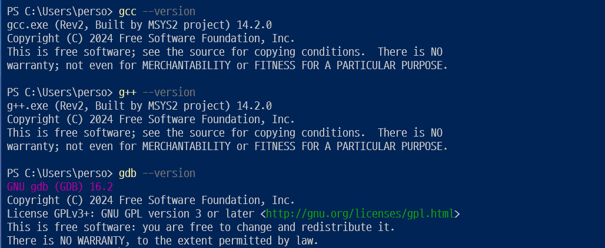
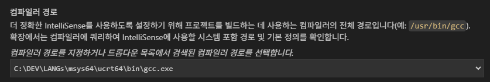
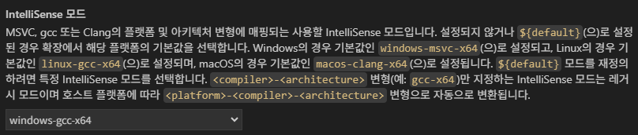
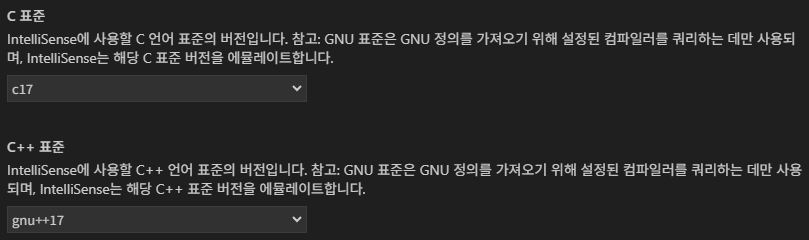
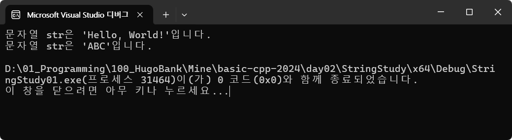
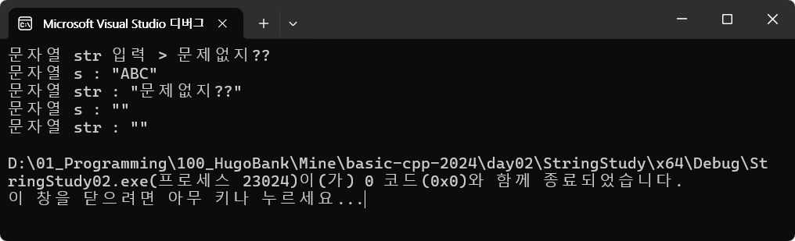
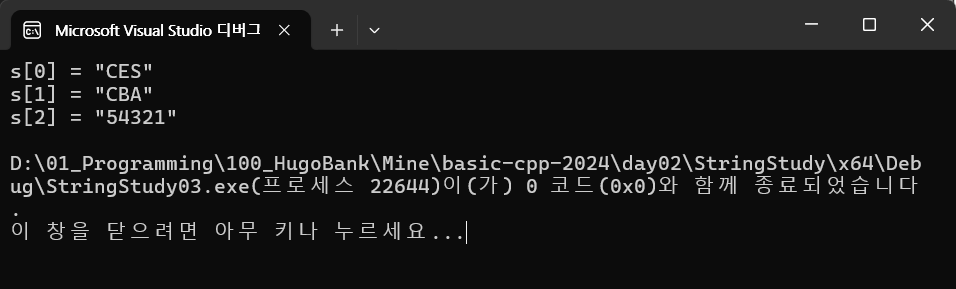
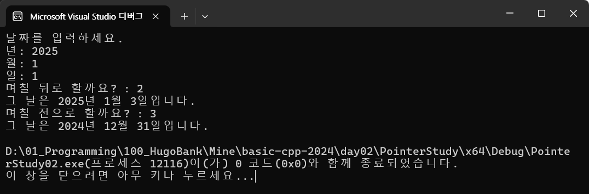

# 심화 프로그래밍 2024
IoT 개발자 심화 프로그래밍 언어 학습리포지토리

## 0일차
- https://basiclike.tistory.com/360 참조
- Visual Studio Code에 C/C++ 개발환경 
	- https://github.com/msys2/msys2-installer/releases/ 에서 msys2-x86_64-20250221.exe 파일 다운로드
	- 설치 후 콘솔에 
	- pacman -S --needed base-devel mingw-w64-ucrt-x86_64-toolchain 실행
	- 시스템 정보 환경변수 추가

	

- VS Code > C/C++ Extension Pack 설치

- Ctrl + Shift + P > C/C++: Select a Configuration 선택
	- 구성편집 (UI) 선택

	

	

	

- 설정 후 
	.vscode \ c_cpp_properties.json 생성됨
- 최초 실행 후
	.vscode \ tasks.json 생성됨

## 1일차
- 개발환경 설치
	- Visual Studio 2022 Community 설치
	- C, C++ 소스코드 실행

- 열혈강의 Chap01

## 2일차
- C언어 문자열 학습

	1. 기본 문자열 - [소스](./day02/StringStudy/StringStudy/main.c) 

		

	2. 빈 문자열 조작 - [소스](./day02/StringStudy/StringStudy02/main.c)
		- scanf() 사용시 컴파일 에러 : #define _CRT_SECURE_NO_WARNINGS 사용할 것

		

	3. 문자열 배열 읽어 반전 출력 - [소스](./day02/StringStudy/StringStudy03/main.c)

		

- C언어 포인터 학습

	1. 포인터 기본 - [소스](./day02/PointerStudy/PointerStudy01/main.c)

	2. 포인터로 윤년포함 날짜 변경 - [소스](./day02/PointerStudy/PointerStudy02/main.c)

		

	3. 계속...

## 3일차

## 4일차

## 5일차

## 6일차

## 10일차 